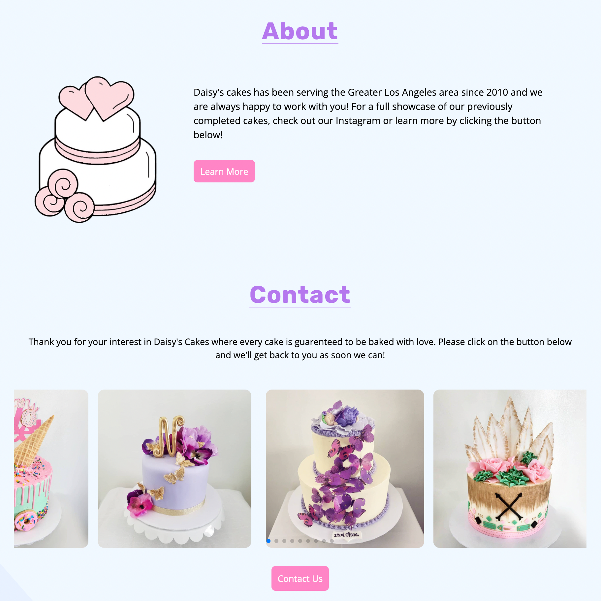
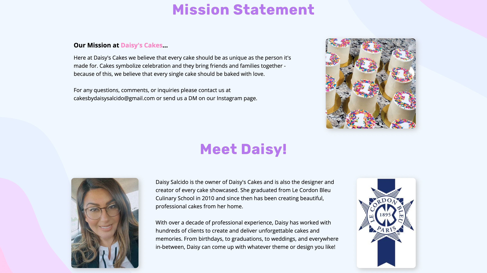
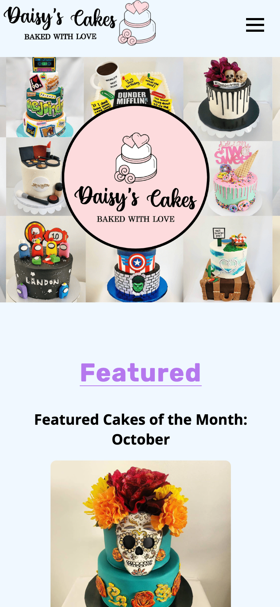

# Daisy's Cakes

Full Stack MERN website for local small business "Daisy's Cakes"!

## Description

The purpose of this project was to collaboratively build a real-world, full-stack, MERN web application that demonstrates everything we have learned over the last several months in our bootcamp. For a full list of the various libraries, packages, and technologies utilized for this project, please refer to the [Technologies](#technologies) section below.

For this project we decided to partner up with a local business owner in order to build a website for her company, Daisy's Cakes. Because of this, we had to take her ideas and desires for the website into consideration. We would then take her ideas and turn them into reality, implementing them on the website.

The live website can be accessed by clicking [here.](https://bakedwithlove.herokuapp.com/)

## Table of Contents

- [Installation](#installation)
- [Technologies](#technologies)
- [Contribution](#contribution)
- [Screenshots](#screenshots)
- [Questions](#questions)

## Installation

Please be sure to carefully follow the installation instructions.

1. This app is powered by Node.js and MongoDb, as a result, make sure those are properly installed and configured before continuing on.
2. Navigate to the root of this repo and run `npm install` in your console/terminal to download all the necessary files.
3. Create a `.env` file in the root of the `/server` folder. Within this file, copy and paste the following:

```md
ADMIN_USERNAME=<admin_name>
ADMIN_EMAIL=<admin_email>
ADMIN_PASSWORD=<admin_password>
```

_This application utilizes EmailJS for the the automatic email form You must create an account on the website and input your credentials in the format below. If you do not wish to use the EmailJS functionality then step 4 can be skipped_

4. Change the value of the `ADMIN` variables to whatever you want your administrator login for the website to be. 5. Navigate to the `/client` folder and create a new file in the root called `.env`. Within this file, copy and paste the following:

```md
REACT_APP_SERV_KEY=<server_key>
REACT_APP_FORM_TEMPLATE=<template_key>
REACT_APP_FORM_PUB_KEY=<public_key>
```

5. In your console/terminal, execute `npm run seed` from the root of your repo to seed the database.
6. You are now ready to run the application by running `npm run develop`.

---

## Technologies

Below is a list of all the technologies we utilized in order to build this website.

### Server

- [adminbro](https://beta.adminbro.com)
- [apollo-server-express](https://www.npmjs.com/package/apollo-server-express)
- [bcrypt](https://www.npmjs.com/package/bcrypt)
- [express](https://www.npmjs.com/package/express)
- [graphql](https://graphql.org)
- [jsonwebtoken](https://jwt.io)
- [mongoose](https://mongoosejs.com)

### Client

- [@apollo/client](https://www.apollographql.com/docs/react/get-started/)
- [framer-motion](https://www.framer.com/motion/)
- [graphql](https://graphql.org)
- [jwt-decode](https://jwt.io)
- [react](https://reactjs.org)
- [react-bootstrap](https://react-bootstrap.github.io)
- [react-dom](https://reactjs.org/docs/react-dom.html)
- [react-router-dom](https://www.npmjs.com/package/react-router-dom)
- [react-scripts](https://www.npmjs.com/package/react-scripts)
- [sass](https://sass-lang.com)
- [stripe](https://stripe.com)
- [sweetalert](https://sweetalert.js.org)
- [swiperjs](https://swiperjs.com)

---

## Contribution

_This section will be deleted later when the project is completed. For now here are some resources we might need_

- Link to Google Drive with [cake images](https://drive.google.com/drive/folders/1Hp05hOxrL5-NDPJ3JWRKqbTdWXYGWr_1?usp=sharing)
- Daisy's [Instagram page](https://www.instagram.com/daisycakes87/?next=%2Fdaisycakes87%2F)
- [SASS / SCSS Documentation](https://sass-lang.com/documentation/)

- Be sure to configure your linter so we have code uniformity. You can also run `npm run lint` from within the `/client` folder or `/server` folder to fix any syntax anamolies!

---

## Screenshots

Below are various screenshots of the website:








---

## Questions

If you have any questions or comments, please contact any of us below:

### Gilberto Escobedo

Github: [n7-gil](https://github.com/n7-gil)

Email: gilbertoaescobedo@gmail.com

LinkedIn: [Gilberto Escobedo](https://www.linkedin.com/in/gilbertoaescobedo/)

### Anthony Quinones

Github: [TonyQ032](https://github.com/TonyQ032)

Email: anthonyq032@gmail.com

LinkedIn: [Anthony Quinones](https://www.linkedin.com/in/anthony-quinones/)

### Christian McIlvenny

Github: [TDGNate](https://github.com/TDGNate)

Email: itsnzte@gmail.com

LinkedIn: [Christian McIlvenny](https://www.linkedin.com/in/christian-mcilvenny/)

### Cesar Infante

Github: [Cesar-Infante](https://github.com/Cesar-Infante)

Email: cesar261110@gmail.com

LinkedIn: [Cesar Infante](https://www.linkedin.com/in/cesarinfante/)

### Nguyen Doan

Github: [NguyenDoan85](https://github.com/NguyenDoan85)

Email: ericdoan2008@gmail.com

LinkedIn: [Eric Doan](https://www.linkedin.com/in/ericdoan85/)

---

Copyright © 2022 Daisy's Cakes - All Rights Reserved
